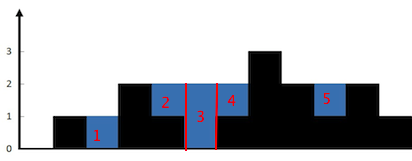

# 单调栈
水平切分。

计算蓄水体积顺序如下：


单调递减地入栈，如果升高了，说明可能有坑，需要从栈里取前面的墙。坑有两面墙，一面是栈的第二个元素，一个是当前位置，坑的深度等于两面墙的较低墙减去坑高度。

这种思路从左到右优先计算最近两面墙的坑，所以计算完墙下标会回退，所以用栈来回退。由于计算时两面墙不一定最近，所以会出现`距离*坑深度`。


```java
class Solution {
    public int trap(int[] height) {
        int res = 0;
        Deque<Integer> stack = new LinkedList<>();
        int cur = 0;
        while (cur < height.length) {
            while (!stack.isEmpty() && height[cur] > height[stack.peek()]) {
                int trap = height[stack.pop()];
                // 说明前面没有墙, 没有墙的坑位丢弃
                if (stack.isEmpty()) {
                    break;
                }
                int distance = cur- stack.peek() - 1;
                int h = Math.min(height[cur], height[stack.peek()]) - trap;
                res += distance * h;
            }
            stack.push(cur++);
        }
        return res;
    }
}
```
# 双指针
    Accepted
    320/320 cases passed (1 ms)
    Your runtime beats 99.99 % of java submissions
    Your memory usage beats 82.54 % of java submissions (38.2 MB)
    
垂直切分。

计算蓄水体积顺序如下：


这种思路需要保存左右最高的墙，迭代下标时，优先计算低的位置，因为坑位低的会成为蓄水多少的上限或者说短板，只要拿坑位深度和当前短板去计算，就知道这个坑位能蓄水多少。

```java
class Solution {
    public int trap(int[] height) {
        int leftMax = 0;
        int rightMax = 0;
        int res = 0;
        int left = 0, right = height.length - 1;
        while (left < right) {
            if (height[left] < height[right]) {
                if (height[left] >= leftMax) {
                    leftMax = height[left];
                } else {
                    res += leftMax - height[left];
                }
                left++;
            } else {
                if(height[right] >= rightMax) {
                    rightMax = height[right];
                } else{
                    res += rightMax - height[right];
                }
                right--;
            }
        }
        return res;
    }
}
```

