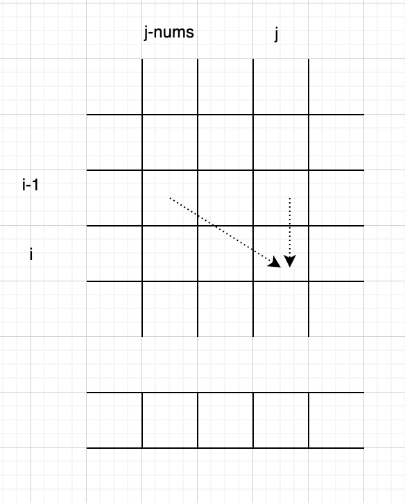

# 二维DP
```java
class Solution {
    public boolean canPartition(int[] nums) {
        int n = nums.length;
        int sum = Arrays.stream(nums).sum();
        boolean[][] dp = new boolean[n+1][sum+1];
        for (int i = 1; i <= n; i++) {
            dp[i][0] = true;
        }
        // 你都不能整除
        if (sum % 2 != 0) return false;
        for (int i = 1; i <= n; i++) {
            for (int j = 1; j <= sum/2 ; j++) {
                // 装不下了
                if (j - nums[i-1] < 0) {
                    dp[i][j] = false;
                } else {
                    // 上一个不装 || 上一个装
                    dp[i][j] = dp[i-1][j] || dp[i-1][j-nums[i-1]];
                }
            }
        }
        return dp[n][sum/2];
    }
}
```
# 一维DP
观察`dp[i][j] = dp[i-1][j] || dp[i-1][j-nums[i-1]]`，



按照原来的遍历顺序，`i-1`层的值用完就没用了，`i`直接抹除

`j`和`j-nums[i]`列的值可能会重复用到，且不更新，所以从后向前遍历。

可能你会想，`d[j]`用的是`d[j-nums[i-1]]`的值，`d[j-nums[i-1]]`还没求，怎么能求`d[j]`，事实上，`d[j-nums[i-1]]`在二维dp里是`dp[i-1][j-nums[i-1]]`，是上一层`i-1`层的数据，由于我们是从`[0....i]`的顺序遍历，所以上一层所有值已经求好了，也就是说`d[j-nums[i-1]]`已经求好了。

```java
class Solution {
    public boolean canPartition(int[] nums) {
        int n = nums.length;
        int sum = Arrays.stream(nums).sum();
        if (sum % 2 != 0) return false;
        boolean[] dp = new boolean[sum+1];
        dp[0] = true;
        // 你都不能整除
        for (int i = 1; i <= n; i++) {
            for (int j = sum/2; j >=1 ; j--) {
                // 装的下
                if (j - nums[i-1] >= 0) {
                    // 上一个不装 || 上一个装
                    dp[j] = dp[j] || dp[j-nums[i-1]];
                }
            }
        }
        return dp[sum/2];
    }
}
```