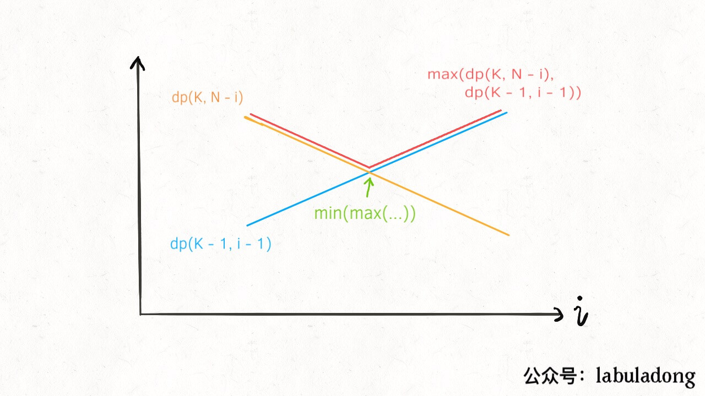

# 递归
> leetcode会超时，K=4,N=5000 

给定k个鸡蛋n层楼，求碎的临界点。

感觉这道题比较难理解，我觉得原因之一是暴力破解我都不知道怎么暴力。

这个问题的本质，楼层其实可以化为有序的0或者1，碎就是1，0就是不碎，比如：00000...11111是N层楼，而我们的任务就是要找出这个`01`交界处，也就是零界点。我们要有一个通用的策略，找这个零界点。二分法可以很快，但是不能用，因为鸡蛋遇到1的楼会碎，可以搜索的次数会减-1。遇到0的，可以搜索次数不变。

题目要求我们最终这个策略在所有策略中是步数最少的。

那么策略是什么呢，策略就是“我拿一个蛋在哪层楼扔”->“接下来去哪里扔”。

当“我拿一个蛋在哪层楼扔”是一件确定的事之后，比如我在i层楼扔，接下来就要决定去哪里扔。如果碎了，那可以确定1～i-1层的值都是0，那么问题规模就变成：00000...11111是(i-1)层楼，找临界点。如果没碎，那么问题规模变成：00000...11111是(N-i)层楼，找临界点。因为问题是要求“次数”而不是“路径”，所以我们只要在“碎”和“不碎”产生的新问题选取一个作为状态转移。那么碎不碎我怎么知道选择哪个，这是临界点决定的，我们不知道，所以两种情况都假设一遍，既然是假设的，那肯定有一种是乐观的假设，一种是悲观的假设，换句话说，一种是运气好的假设，一种是最坏情况的假设，我们拿那个次数**多的**，就是最坏情况的假设。为什么不是碎了就是最坏情况呢。因为鸡蛋碎了可以排除掉i层以上的楼层，由于我们有多个鸡蛋，所以“碎”和“不碎”其实没有说哪种就是运气好，哪种就是运气坏，运气好运气坏得看这个分支的扔的次数。

我们要求**最坏情况**下**最小次数**，感觉两个描述很绕。

那么问题来了，这个i层是哪一层，我们要从哪一层开始扔？不知道🤷‍♂️，所以要遍历所有i的可能取值作为起始，取**小的**。

```java
class Solution {
    // k个蛋，n层，搜索的次数
    public int superEggDrop(int K, int N) {
        return dp(K, N);
    }

    private Map<String, Integer> map = new HashMap<>();

    public int dp(int k, int n){
        if (k == 1) return n;
        // 假设1层，那么最少需要测试1次，所以0层应该是0
        if (n == 0) return 0;
        Integer res;
        String key = k + "," + n;
        res = map.get(key);
        if(res != null) {
            return res;
        } else{
            res = Integer.MAX_VALUE;
        }
        // 这个只是比较不同的起点
        for (int i = 1; i <= n; i++) {
            res = Math.min(res, Math.max(dp(k, n-i), dp(k-1, i-1)) + 1);
        }
        map.put(key, res);
        return res;
    }
}
```

# 二分法优化
把从1到到n的遍历用二分法优化。

因为碎和不碎的最大值的最小值发生在两线性函数的交点上。
```java
class Solution {
    // k个蛋，n层，搜索的次数
    public int superEggDrop(int K, int N) {
        return dp(K, N);
    }

    private Map<String, Integer> map = new HashMap<>();

    public int dp(int k, int n){
        if (k == 1) return n;
        // 假设1层，那么最少需要测试1次，所以0层应该是0
        if (n == 0) return 0;
        Integer res;
        String key = k + "," + n;
        res = map.get(key);
        if(res != null) {
            return res;
        } else{
            res = Integer.MAX_VALUE;
        }
        int lo = 1, hi = n;
        int mid;
        while(lo <= hi) {
            mid = (lo + hi) / 2;
            int broken = dp(k-1, mid-1);
            int notBroken = dp(k, n - mid);
            if (notBroken > broken) {
                lo = mid+1;
                res = Math.min(res, notBroken + 1);
            } else{
                hi = mid - 1;
                res = Math.min(res, broken +1);
            }
        }
        map.put(key, res);
        return res;
    }
}
```

# 另一种DP定义
定义:k个鸡蛋扔m次最坏情况下能至多确定n层楼。我们要求的就是`dp[k][m]=N`时，m的值。

总的楼层数 = 楼上的楼层数 + 楼下的楼层数 + 1

楼上的层数问题变成：k个鸡蛋，扔m-1次
楼上的层数问题变成：k-1个鸡蛋，扔m-1次（碎了一个）

`dp[k][m]=dp[k][m-1]+dp[k-1][m-1]+1`

```java
class Solution {
    // k个蛋，n层，搜索的次数
    public int superEggDrop(int K, int N) {
        int[][] dp = new int[K + 1][N + 1];
        int m = 0;
        while(dp[K][m] < N) {
            m++;
            for (int i = 1; i <= K; i++) {
                dp[i][m] = dp[i][m-1] + dp[i-1][m-1] + 1;
            }
        }
        return m;
    }
}
```

