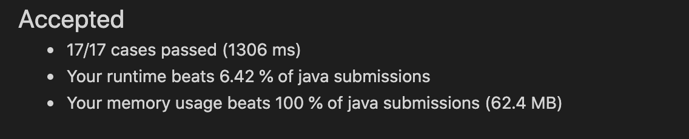

好鸡儿慢啊
```java
import java.util.HashSet;
import java.util.LinkedList;
import java.util.Queue;
import java.util.Set;

/*
 * @lc app=leetcode.cn id=1032 lang=java
 *
 * [1032] 字符流
 */

// @lc code=start
class StreamChecker {

    Trie checker;

    public StreamChecker(String[] words) {
        Set<String> set = new HashSet<>();
        Trie trie = new Trie();
        // 感觉这个前缀树花了很长时间
        for (String word: words) {
            if (set.contains(word)) {
                continue;
            }
            trie.insert(word);
            set.add(word);
        }
        trie.createFail();
        checker = trie;
    }
    
    public boolean query(char letter) {
        return checker.match(letter);
    }

    class Trie {
        Node root;
        Node p; // 指针状态
    
        public Trie() {
            this.root = new Node();
        }

        /**
         * 为什么是广度优先遍历
         * <p>
         * 我觉得是fail指针都是子指向父，所以先处理父
         *
         * @param trie
         */
        void createFail() {
            Queue<Node> queue = new LinkedList<>();
            queue.offer(root);
            while (!queue.isEmpty()) {
                Node father = queue.poll();
                if (father.sub == null) {
                    continue;
                }
                for (int i = 0; i < father.sub.length; i++) {
                    Node child = father.sub[i];
                    if (child == null) {
                        continue;
                    }
                    if (father == root) { // 第一层
                        child.fail = root;
                    } else { // 其他层
                        Node fail = father.fail;
                        while (fail != null) { // fail == null 即跑到root去了
                            if (fail.sub[i] != null) {  // 只要那个i位置有字符 就是值和child相等
                                // 由于是往上搜索，所以sub会一直有
                                child.fail = fail.sub[i];
                                break;
                            }
                            fail = fail.fail; // 如果没有遇上相等，就继续转移状态
                        }
                        if (fail == null) { // 这是跑到root的fail去了
                            child.fail = root;
                        }
                    }
                    queue.offer(child);
                }
            }

            p = root;
        }

        void insert(String word) {
            Node cur = root;
            for (int i = 0; i < word.toCharArray().length; i++) {
                int index = word.charAt(i) - 'a';
                if (cur.sub == null) {
                    cur.sub = new Node[26];
                }
                Node n = cur.sub[index];
                if (n == null) {
                    n = new Node();
                    cur.sub[index] = n;
                }
                cur = n;
                if (i == word.toCharArray().length - 1) {
                    cur.end = true;
                }
            }
        }

        boolean match(char letter) {
            int index = letter - 'a';
            // p.sub[index] 是找到匹配的, p == root 是状态转移到头了
            while (p != root && (p.sub == null || p.sub[index] == null)) {
                p = p.fail;
            }
            p = p.sub != null ? p.sub[index] : null;
            if (p == null) {
                p = root;
            }
            Node node = p;
            while (node != root) {
                if (node.end) {
                    return true;
                }
                node = node.fail;
            }
            return false;
        }
    }
    
    class Node{
        Node[] sub;
        Node fail;
        boolean end;
    }
}
```